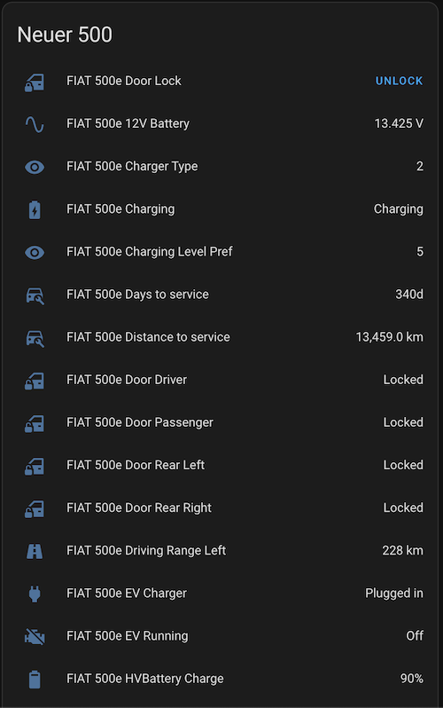

Connect your Uconnect-enabled vehicle to Home Assistant. This integration has been made from the reverse-engineered Stellantis vehicle-branded apps and websites.

## Car Brands

US, Canada, EU & Asia regions are supported. Try a different region if the originally selected region does not authenticate.

- Jeep: Works ✅ 
- Fiat: Works ✅ 
- Ram: Works ✅ 
- Dodge: Unknown ❔
- Alfa Romeo: Works ✅ 
- Chrysler: Unknown ❔
- Maserati: Unknown ❔

## Tested Vehicles

- See tested and working vehicles at the following discussion post: https://github.com/hass-uconnect/hass-uconnect/discussions/5
- If your vehicle works, feel free to upload the year, make and model to the discussion post.

## Prerequisites 📃

- Home Assistant
- [HACS](https://www.hacs.xyz) (Home Assistant Community Store) 
- A vehicle using Uconnect cellular services, **vehicles that use SiriusXM Guardian are not supported**
- Check the links below:
  - Fiat: https://connect.fiat.com
  - Jeep: https://connect.jeep.com
  - Ram: https://connect.ramtrucks.com
  - Dodge: https://connect.dodge.com
  - AlfaRomeo: https://connect.alfaromeo.com
  - Chrysler: https://connect.chrysler.com
  - Maserati: https://connect.maserati.com

## Features ✔️

- Imports statistics like battery level 🔋, tire pressure ‍💨, odometer ⏲ etc. into Home Assistant
- Multiple Brands: Fiat, Jeep, Ram, Dodge, Alfa Romeo, Chrysler & Maserati
- Multiple Regions: America, Canada, Europe & Asia
- Supports multiple cars on the same account 🚙🚗🚕
- Location tracking 🌍
- Live vehicle status such as windows/doors, and ignition status for supported vehicles
- Home Assistant zones (home 🏠, work 🏦 etc.) support
- Uses the same data source as the official app 📱
- Remote commands (unlock doors 🚪, switch HVAC 🧊 on , ...). **Use a service (action) to trigger commands**. Some commands may not work with all vehicles
- Available commands are:
  - `Refresh Location`: Updates the vehicle location
  - `Deep Refresh`: Refreshes EV battery level
  - `Lights/Horn`: Trigger vehicle horn and lights
  - `Lights`: Trigger vehicle lights
  - `Preconditioning On/Off`: Toggle vehicle preconditioning
  - `Trunk Lock/Unlock` / `Liftgate Lock/Unlock`: Lock/Unlock trunk/liftgate
  - `Doors Lock/Unlock`: Lock/Unlock vehicle doors
  - `Engine On/Off`: Remotely starts/stops the vehicle engine
  - `Charge Now`: Initiates EV charging
  - `HVAC On/Off`: Toggles the HVAC
  - `Comfort On/Off`: Another alternative to the above HVAC commands (depends on make/model)
  - `Update`: Asks the integration to update the data from the API immediately

## What will NEVER work? ❌

- Things the Uconnect API does not support such as real time tracking or adjusting the audio volume.
- Some commands are vehicle specific and do not work across all makes and models.
- Some vehicles do not support live status for locks/windows/ignition. 

## How to install 🛠️

- Make sure you have [HACS](https://hacs.xyz/docs/use/#getting-started-with-hacs) already installed
- Add the [repository URL](https://github.com/hass-uconnect/hass-uconnect) to your HACS custom repositories as type `integration`
- Install the integration and restart Home Assistant
- Go to your integrations configuration page once started and add the Uconnect integration
- Fill e-mail, password and optionally PIN if you want to issue commands

## Example

## Useful Resources

Cards: 
  - [Ultra Vehicle Card](https://github.com/WJDDesigns/Ultra-Vehicle-Card)
  - [Vehicle Status Card](https://github.com/ngocjohn/vehicle-status-card)
